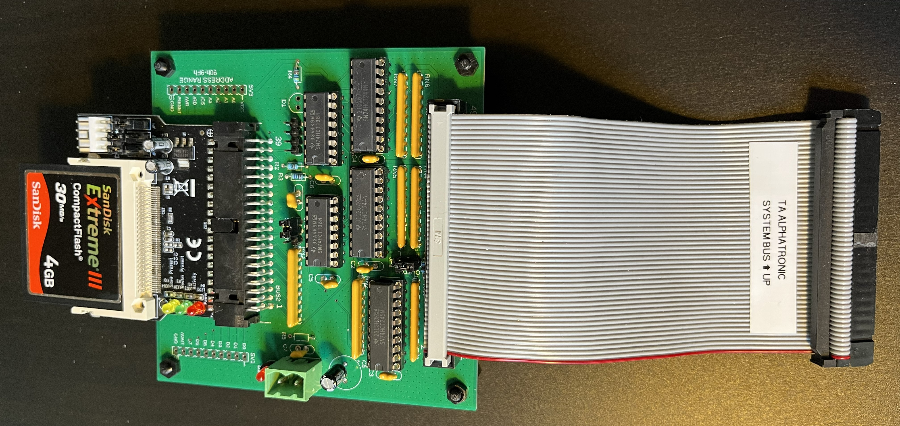
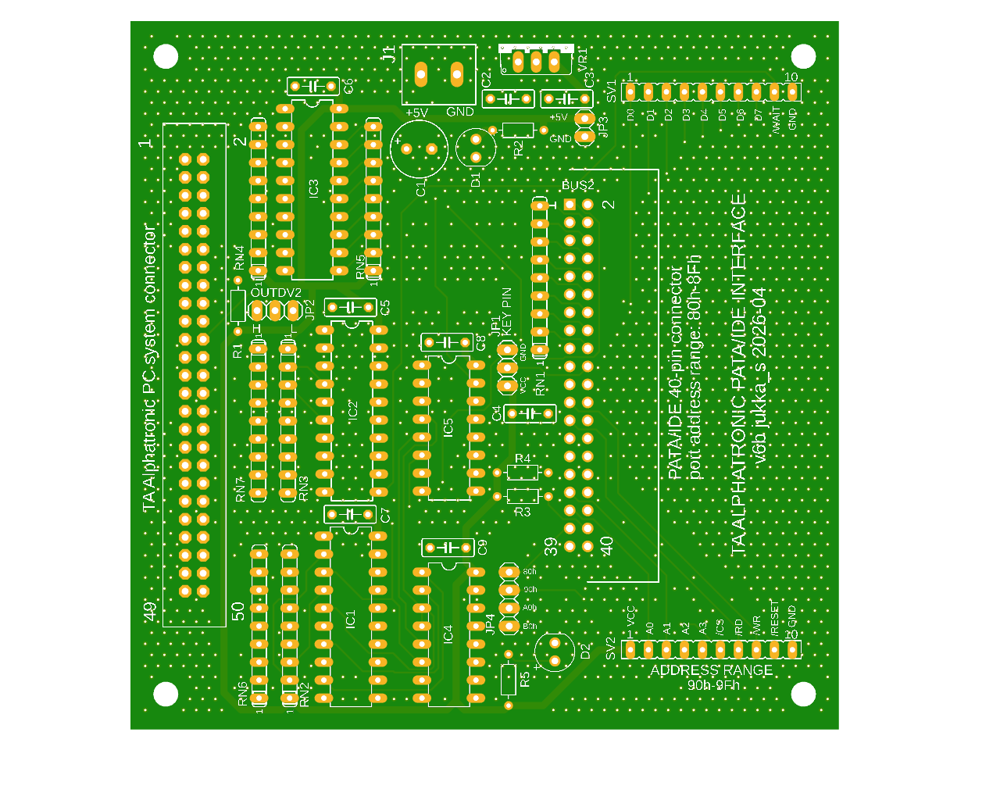
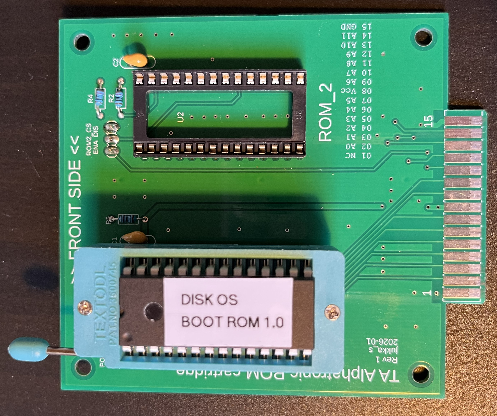
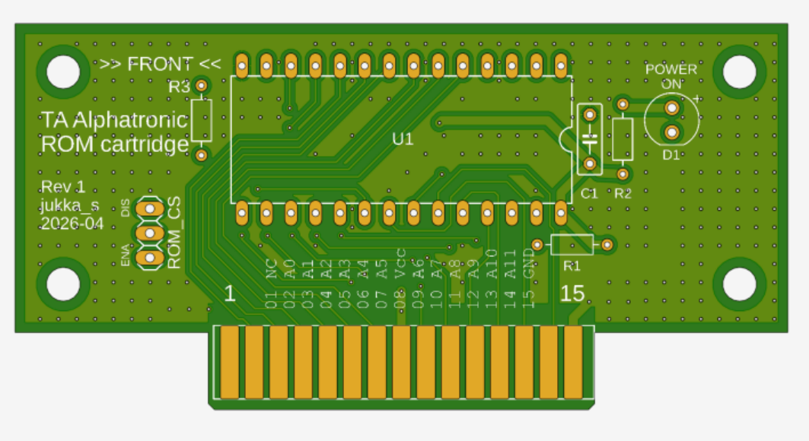

# TA Alphatronic PC with PATA/IDE interface, boot ROM and CP/M 2.2 for PATA/IDE storage

## Background

I needed a project for the dark winter months, preferably one that includes both hardware and software design. I came across with a TA Alphatronic PC, which seemed interesting because I started programming in 1980's and having something like that on your desk would have been amazing at the time. Also, the TA seemed to be rare and esoteric enough that there weren't that many existing projects for it (although I didn't spend much time searching as I didn't want to find any).

So, I had a computer with Z80, 64k of memory, surprisingly decent keyboard and 80-column text. This was practically screaming for CP/M. It did have CP/M supporting floppy drives, but those seem to be rarer than the PC itself. One reason is that the floppy controller is built into the floppy drive and the optional second floppy is connected to the first drive. I followed eBay for a while, but there was only one set being sold and with a price I wasn't willing to pay. I had found my project.

## Design Criteria

I set to myself the following criteria:

1. No hardware modifications to the TA Alphatronic PC itself
2. No modifications to the original ROM's
3. Implemented with (roughly) the 1980's or 1990's components
4. No modern processors that are faster than the Z80 i.e. no emulation of hardware with raw processing power
5. The result should be standalone i.e no need for a modern PC to support normal use
6. Save the serial port for other purposes

I rejected the following approaches (among a few others):

- I did find the schematics of the original floppy controller and it would have been easy to design a PCB and rebuild one. However, I would still need floppy drives.
- For a moment I considered building a device that pretends to be the original controller, but then actually uses some other storage device. That would have violated at least one of the design principles, although it would have allowed the use of the original CP/M.

At the end I decided to: 

1. design an external PATA/IDE interface connected to the system bus connector
2. write a new external boot ROM that nicely integrates with the normal booting sequence
3. rewrite the disk routines in the CP/M CBIOS (note: I will be using "CBIOS" for the CP/M code and "BIOS" for the TA's own BIOS code)

## Acknowledgments

A lot was borrowed from Donn Stewart's excellent website http://cpuville.com/:

- serial monitor code
- IDE/PATA CBIOS code
- the disk layout of 4 drives by 2 Mbytes each (other layouts are also possible - I'll add a section about that at some point)
- cpmformat and putsys code
- IDE/PATA hardware interface basics

The CP/M IOBYTE support was added by looking at many examples, but unfortunately I did't write down where each idea or piece of code was taken from - apologies! If you see something that looks like yours, let me know and I will add a link here.

The following were important sources when I was trying to figure out what the TA's original BIOS is doing:

- The listing of a Terminal Program software in TA Alphatronic PC Almanach '85/86 by H.Ströber
- Disassembled TA boot ROM by Andreas Ziermann (https://github.com/anchorz/symbolic-disassembler/blob/master/TA%20Alphatronic%20PC8%20Bios%20ROM%20Listing/src/rom.s)


## Hardware - PATA/IDE Board

The PATA/IDE board is connected to the TA system bus. As it is located outside of the TA case and has a cable (in my implementation a short ribbon cable), it was necessary to add buffering and bus termination resistors as otherwise the signals were badly distorted and caused glitches.

Below is my prototype version and the latest version of the PCB. The gerbers are in the hardware folder so you can easily order the PCB's from your favorite supplier.




### Power

The TA system bus does not have 5V pin, so the IDE/PATA extension needs its own 5V power supply. It can be connected to J1. If you decide not to install the on-board regulator, solder a jumper wire from regulator pin1 to pin3.

The 5V from J1 can be connected to the KEYPIN of the PATA/IDE connector (see "Jumpers" below) in case you have a setup that supports that. In my case I use a PATA/IDE to CF adapter that can take power from the KEYPIN and can also tolerate 5V. In the case of your CF is 3.3V only, use a CF adapter that has built-in 3.3V regulator, or arrange the power supply in some other way.

The power on sequence is:

1. Power on the PATA/IDE board
2. Power on the TA

However, my TA sometimes fails to boot up. If you don't hear the beep right after you hit the power switch you know the TA has crashed. In such a case just press the reset button behind the TA and it boots fine. In my case it happens when the computer is turned on for the first time. Once it warms up, the glitch disappears. There are probably some hardware improvements that could be made to keep the bus signals clean during the power on, but it's not very high on my priority list.

### Jumpers

The board has two jumpers:

|Jumper | Position| Description |
|-----------|----------|---------|
| JP1 OUTDV2 | Center to H   | The default position as it is used by the boot code to check whether the IDE/PATA device is connected.
|              | Center to L   | You can use this to disable PATA/IDE cards without disconnecting the cable.
| JP2 KEYPIN | Center to Vcc | You can power the PATA/IDE device with 5V (CF card, for example) via the KEYPIN, if supported by the device
|              | Center to GND | IDE/PATA connector's KEY PIN becomes GND
| | no jumper | KEYPIN is floating |

### I/O addresses

The PATA/IDE device is mapped to I/O-ports 80h-8Fh

To facilitate experimenting, I added a possibility to add a small daughter card that is mapped to I/O address 90h-9fh. I'm thinking of using it to add a second serial port at a later date. In addition, there are pins where you can get /CS signals for other ranges - see below.

| I/O Address range | Purpose |
|-----------|----------|
| 10h - 7Fh | reserved by TA original hardware   |
| 80h - 8Fh | PATA/IDE device   |
| 90h - 9Fh | daughter card device   |
| A0h - AFh | extra /CS - requires wiring  |
| B0h - BFh | extra /CS - requires wiring  |
| F0h - FFh | reserved by TA original floppy controller  |

### Oddities in the bus signals

Note that the original TA floppy controller behaves as follows:

    [chip /RD] is low when [bus /SIOR] or [bus /RD] is low
    [chip /WR] is low when [bus /SIOW] or [bus /WR] is low

That didn't work in my case as the /SIOR and /SIOW signals were low all the time. I don't know if it's caused by a hardware issue in my TA or whether there's something wrong otherwise. However, using only /RD and /WR only works perfectly in my case, so the PCB is implemented like that. I do have a version of the board with the expanded /CS logic and can upload it if someone is interested.

## Hardware - External ROM adapter
The TA has an external ROM socket that is used for our OS Boot ROM. I made a PCB for development purposes that can house two 8k ROM's. For normal use there is a version for one ROM that is small enough that the ROM socket cover can be kept in place. That way the ROM remains hidden.



## Software

(section to be written)

- OS Boot ROM
- CP/M boot loader
- CP/M CBIOS
- bootstrap utilities

## Installation and setup

A quick version below. I will improve it later. I'll use "PC" meaning your Windows/Linux/whatever computer and "TA" meaning the TA Alphatronic PC.

### Getting control over the TA
1. Connect the IDE/PATA interface to the TA system connector
2. Insert the OS Boot ROM to the TA extenal ROM socket
3. Connect a null-modem cable (and USB-to-serial dongle) between TA and your PC and launch your favorite terminal emulator application in the PC. Set it for 9600-N-8-1 and select the right port. Note that the terminal emulator should support xmodem file transfers.
4. Power on the TA IDE/PATA interface
5. Power on the TA itself
6. You should hear a beep. If not, press the reset button located behind the TA
7. You should see the OS Boot ROM title on the TA screen. Press [ESC] to launch the serial monitor. You should hear another beep and see the orange led turn on in the keyboard (the "graph" led).
8. Go to the terminal emulator in your PC, connect and you should see a prompt.

The RAM monitor code handles backspace locally and emits some control characters in the process. You may have to tweak the settings of your terminal software to accomodate that.

### Installing CP/M

The file length below is as it was at the time of writing. Check the size of the file that you are using and use the correct length.

```
ROM ver. 8.a for TA Alphatronics

>bload
Loads a binary file into memory.
Enter 4-digit hex address (use upper-case A through F): 2000
Enter length of file to load (decimal): 9159

Ready to receive, start transfer.
```

At this point use the terminal emulator menus to send the file ```cpmsetup.bin```. Once it's been loaded succesfully you are back at the prompt:

```
>jump
Will jump to (execute) program at address entered.
Enter 4-digit hex address (use upper-case A through F): 2000

TA Alphatronic PC - CP/M 2.2 Installer

  Copying CP/M to memory...Done.
  Formatting disks...........Done.
  Writing bootloader to disk A:...Done.
  Writing CP/M system to disk A:...Done.
  Copying PCGET.COM to memory (0100h)...Done.
  Returning to monitor...

>jump
Will jump to (execute) program at address entered.
Enter 4-digit hex address (use upper-case A through F): DA00

```
Now go back to the TA console, which should have booted to CP/M and have the ```A:``` prompt. Enter the command:
```
A: save 3 pcget.com
```
After this you have a working CP/M and the PCGET.COM utility as the only file in the system. Use ```DIR``` to see that it is there. Finally, press the TA reset button to test the normal boot sequence (don't select the serial monitor this time).

### Installing CP/M utilities and applications

Now we have an easy way to download any file to the CP/M disk. There's no need to use the serial monitor anymore, unless you want to install CP/M to other disks.

Let's download ```MBASIC.COM``` as an example:

1. At the CP/M prompt, enter ```PCGET MBASIC.COM```
2. Go to your terminal software and use its feature to send the ```MBASIC.COM``` file from your PC with XMODEM protocol.
3. Once the transfer is over, there is ```MBASIC.COM``` in your A: drive.

Repeat the process to download any other files you need. You could make it easier by first downloading a CP/M equivalent of ```unzip``` and then preparing a "zip" file in your PC so that you can download groups of files at once.
